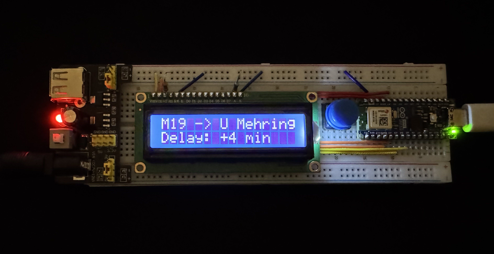
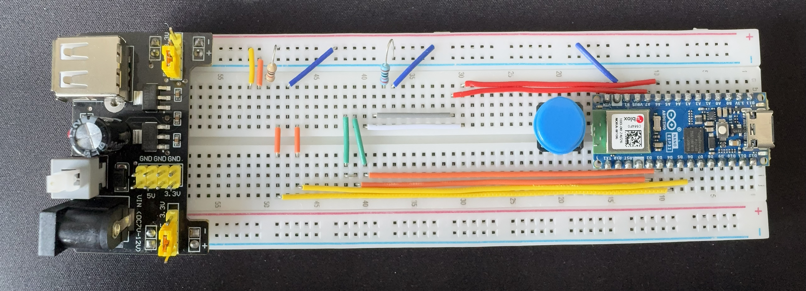

# VBB Monitor 🚂

## 🗺️ Overview
The VBB Monitor is an ESP32-based IoT device that displays real-time public transit departures for the Berlin/Brandenburg (VBB) network. Using a standard 16x2 LCD, it shows the upcoming train/bus line, its destination, and real-time delay information. 

Instead of hardcoding WiFi credentials or station IDs, this project features a built-in Serial CLI that allows users to configure the device on the fly and save settings persistently to flash memory.

## 📌 Features
* **Real-Time API Integration:** Fetches live departure data from the VBB REST API (`v6.vbb.transport.rest`).
* **Delay Tracking:** Automatically calculates and displays delays in minutes (e.g., "on time" or "+2 min").
* **Built-in Serial CLI:** Manage the device via a serial terminal (115200 baud) without recompiling code.
* **Station Search Engine:** Look up VBB stations by name directly through the CLI; the device queries the API, extracts the correct Station ID, and applies it.
* **Persistent Configuration:** WiFi credentials and station preferences are saved to the ESP32's non-volatile memory using the `Preferences` library.

## 🛠️ Hardware Used
* **Microcontroller:** Arduino Nano ESP32 
* **Display:** 16x2 Character LCD (Parallel Interface)
* **Power:** Breadboard Power Supply Module (3.3V / 5V)
* **Components:** Breadboard, jumper wires, current-limiting resistors, and a push button (currently not in use).

## 🔌 Wiring & Pinout
The LCD is wired in 4-bit mode to the Arduino Nano ESP32 using the following pin mapping:
* **RS:** Digital Pin 4
* **EN:** Digital Pin 6
* **D4:** Digital Pin 2
* **D5:** Digital Pin 3
* **D6:** Analog Pin 6
* **D7:** Analog Pin 7

## 💻 Software & Libraries
To compile this project in the Arduino IDE, ensure you have the ESP32 board package installed, along with the following libraries:
* `WiFi.h` & `HTTPClient.h` (Built-in)
* `LiquidCrystal.h` (Standard Arduino library)
* `Preferences.h` (Built-in for ESP32)
* `ArduinoJson` (Install via Library Manager)

## 🚀 Usage & CLI Commands
1. Flash the code to your Arduino Nano ESP32.
2. Open the Arduino Serial Monitor (Set baud rate to **115200** and line ending to **Newline** or **both NL & CR**).
3. On first boot, the LCD will display "No WiFi Config". Use the CLI to set it up.

**Available Commands:**
* `wifi set ssid "YOUR_SSID"`: Sets the WiFi network name.
* `wifi set pass "YOUR_PASSWORD"`: Sets the WiFi password.
* `wifi show`: Displays the current SSID.
* `station qns "STATION NAME"`: Queries the API for a station name (e.g., "Alexanderplatz"), saves the ID, and updates the display.
* `station set "STATION_ID"`: Manually sets a specific VBB Station ID.
* `station show`: Displays the currently saved Station ID.
* `reboot`: Restarts the ESP32 to apply new WiFi settings.

*(By default, if no station is configured, the device defaults to Ostkreuz: ID `900120003`)*.

## 📸 Gallery
### Operating Device

### Assembled

### Wiring
